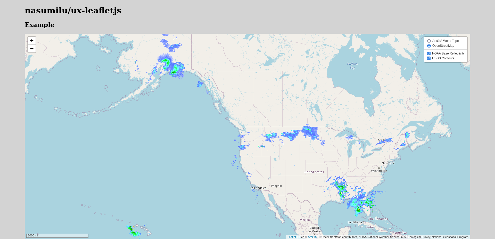

# nasumilu/ux-leafletjs

This is a Symfony UX -> lealfet.js integration component.


## Install

During development install using composer is only possible if you add the git
repository. Upon the first release a packagis and flex recipe will easy the pain
of installing this component. Until then this is the process required:

composer.json
```json
{
    "repositories" [
        {
            "type": "vcs",
            "url": "https://github.com/nasumilu/ux-leafletjs"
        }
    ]
}
```


```sh
$ composer require nasuilu/ux-leafletjs:dev-main
```

## Setup

If not using Symfony Flex then add the bundle to the applications **config/bundles.php**
```php
return [
    ...
    Nasumilu\UX\Leafletjs\LeafletjsBundle::class => ['all' => true],
    ...
];
```

Next install the javascript packages by first updating your applications 
**assets/controllers.json** as follows:
```json
{
    "controllers": {
        ...
        "@nasumilu/ux-leafletjs": {
            "leafletjs": {
                "fetch": "eager",
                "enabled": true
            }
        }, ...

   }
}
```

Next install the @nasumilu/ux-leafletjs javascript dependency and build

With yarn
```sh
$ yarn install --force
$ yarn build
```

or with npm
```sh
$ npm install --force
$ npm run build
```


## Usage

### Configure

There are a couple of ways to configure the map. Probably the most straight forwards is to 
use the `MapFactory` service. First, some quick bundle configurations:

```yaml
# config/packages/leafletjs.yaml
leafletjs:
   paths: ['%kernel.project_dir%/config/maps']
```

Next add a map definition file in the `%kernel.project_dir%/config/maps` directory:

```yaml
# %kernel.project_dir%/config/maps/test_map.yaml

test_map:
    zoom: 4
    center: [29.54654, -85.654665]
    maxBounds: [[71.386455, -64.565694],[17.681818, -179.147531]]
    minZoom: 3
    maxZoom: 18
    layers:
        # base map
        esri_world_topo:
           type: tile
           url: 'https://server.arcgisonline.com/ArcGIS/rest/services/World_Topo_Map/MapServer/tile/{z}/{y}/{x}'
           options:
               baseLayer: true
               title: 'ArcGIS World Topo'
               attribution: 'Tiles &copy; <a href="https://services.arcgisonline.com/ArcGIS/rest/services/World_Topo_Map/MapServer">ArcGIS</a>'
        #base map
        osm:
            type: tile
            url: 'https://{s}.tile.openstreetmap.org/{z}/{x}/{y}.png'
            options:
                baseLayer: true
                title: OpenStreetMap
                attribution: '&copy; OpenStreetMap contributors'
        # overlay
        noaa_base_reflectivity:
            type: wms
            url: 'https://idpgis.ncep.noaa.gov/arcgis/services/NWS_Observations/radar_base_reflectivity/MapServer/WMSServer'
            options:
                title: 'NOAA Base Reflectivity'
                transparent: true
                format: image/png
                attribution: 'NOAA National Weather Service'
                layers:
                    - [1, 'default']
        #overlay
        usgs_contours: 
            type: wms
            url: 'https://carto.nationalmap.gov/arcgis/services/contours/MapServer/WMSServer'
            options:
                title: 'USGS Contours'
                transparent: true
                format: image/png
                attribution: ''
                layers:
                    - [1, 'default'] 
                    - [2]
                    - [3]
                    - [4]
                    - [5]
                    - [6]
                    - [7]
                    - [8]
                    - [9]
                    - [10]
    controls:
        - { type: layers, options: { position: topright, collapsed: false } }
        - { type: scale, options: { position: bottomleft, maxWidth: 300, metric: false } }
```

```php

// Controller/MapController.php

class MapController extends AbstractController {


    /**
     * @Route("/", name="app.index")
     * @return ResponseInterface
     */
    public function index(): Response
    {
        return $this->render('index.html.twig');
    }

    /**
     * @Route("/webmap/{name}", name="app.webmap")
     */
    public function map(string $name): Response 
    {
        $map = $this->get('map_factory')->load($name);
        return $this->json($map);
    }

    protected function json($data, int $status = 200, array $headers = [], array $context = []): JsonResponse
    {
        return parent::json($data, $status, $headers, array_merge($context, [AbstractObjectNormalizer::SKIP_NULL_VALUES => true]));
    }

    public static function getSubscribedServices()
    {
        return array_merge(parent::getSubscribedServices(), [
            'map_factory' => '?'.MapFactoryInterface::class
        ]);
    }

}

```

In the template use the `webmap` function:
```twig
{# templates/map/index.twig.html


    {{ webmap({ 'route': 'app.web_map', 'route_args': { 'name': 'test_map' } } ) }}

```



## Learn More

- [YAML map definition](./docs/yaml_map.md)
- [XML map definition](./docs/xml_map.md)
- [PHP map definition](./docs/php_map.md)
- [JSON map definition](./docs/json_map.md)